# Mermaid UML Diagram Reference

> A comprehensive reference for writing UML diagrams using Mermaid syntax. Each section covers when to use the diagram, what each shape and line means, and working code examples.

---

## Table of Contents

1. [Class Diagram](#1-class-diagram)
2. [Sequence Diagram](#2-sequence-diagram)
3. [Use Case Diagram](#3-use-case-diagram)
4. [Activity Diagram](#4-activity-diagram)
5. [State Diagram](#5-state-diagram)
6. [Component Diagram](#6-component-diagram)
7. [Entity Relationship Diagram](#7-entity-relationship-diagram)
8. [Deployment Diagram (C4 Context)](#8-deployment-diagram-c4-context)
9. [Timing Diagram](#9-timing-diagram)
10. [Quick Syntax Cheatsheet](#10-quick-syntax-cheatsheet)

---

## 1. Class Diagram

**Use when:** Modeling the static structure of a system -- classes, their attributes, methods, and how they relate to each other. This is the backbone of object-oriented design.

```
classDiagram
```

### Shapes and Members

| Syntax | Meaning |
|---|---|
| `class ClassName` | Defines a class |
| `ClassName : +field type` | Public attribute |
| `ClassName : -field type` | Private attribute |
| `ClassName : #field type` | Protected attribute |
| `ClassName : +method() returnType` | Public method |
| `ClassName : -method() returnType` | Private method |
| `<<interface>>` | Interface stereotype |
| `<<abstract>>` | Abstract class stereotype |
| `<<enumeration>>` | Enum stereotype |

### Relationship Lines

| Syntax | Arrow | Meaning |
|---|---|---|
| `A <\|-- B` | Solid line + hollow triangle | Inheritance (B extends A) |
| `A <\|.. B` | Dashed line + hollow triangle | Interface implementation |
| `A *-- B` | Solid line + filled diamond | Composition (B is part of A, cannot exist alone) |
| `A o-- B` | Solid line + hollow diamond | Aggregation (B is part of A, can exist alone) |
| `A --> B` | Solid line + open arrow | Association (A uses B) |
| `A ..> B` | Dashed line + open arrow | Dependency (A depends on B) |
| `A -- B` | Solid line, no arrow | Plain association |
| `A "1" --> "many" B` | With multiplicity labels | Cardinality on associations |

### Example

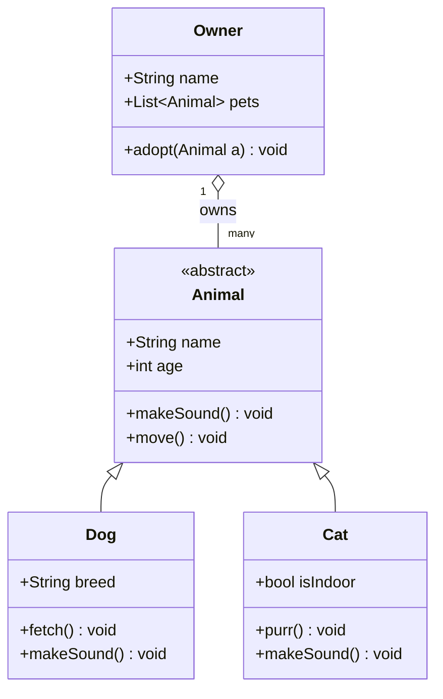

> **Tip:** Use `List~Type~` for generics. Tildes wrap the type parameter.

---

## 2. Sequence Diagram

**Use when:** Showing how objects interact over time in a specific scenario -- the order of messages passed between participants. Great for documenting API calls, login flows, or any multi-step process.

```
sequenceDiagram
```

### Participants

| Syntax | Meaning |
|---|---|
| `participant A` | Declares a participant (rectangle lifeline) |
| `actor User` | Declares a human actor (stick figure) |
| `participant A as Alias` | Participant with display label |

### Message Arrows

| Syntax | Arrow | Meaning |
|---|---|---|
| `A->>B: message` | Solid line + open arrow | Synchronous call |
| `A-->>B: message` | Dashed line + open arrow | Response / return |
| `A-)B: message` | Solid line + async arrow | Asynchronous message |
| `A-xB: message` | Solid line + X | Lost / failed message |
| `A->>+B: message` | Activates B's lifeline | Call that activates the participant |
| `B-->>-A: message` | Deactivates B's lifeline | Return that deactivates the participant |

### Grouping Blocks

| Syntax | Meaning |
|---|---|
| `loop Label` / `end` | Repeated sequence |
| `alt Label` / `else Label` / `end` | Conditional branches |
| `opt Label` / `end` | Optional block |
| `par Label` / `and Label` / `end` | Parallel execution |
| `Note over A,B: text` | Note spanning participants |
| `Note right of A: text` | Note to the right of a participant |

### Example

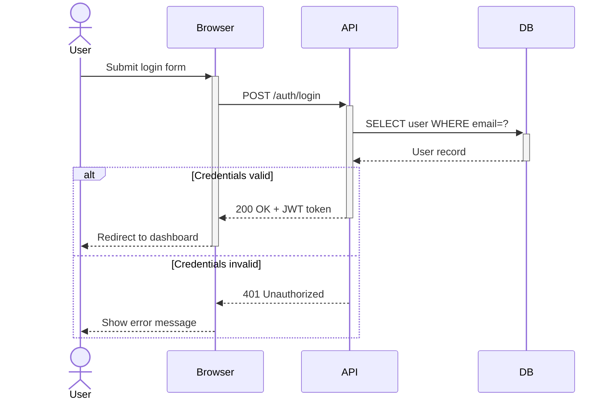

> **Tip:** Use `+` and `-` after `>>` to control activation bars (the tall rectangles on lifelines).

---

## 3. Use Case Diagram

**Use when:** Capturing what a system does from the perspective of its users. Focuses on goals and interactions, not implementation. Great for requirements gathering.

> **Note:** Mermaid does not have a native Use Case diagram type. The closest approximation uses a flowchart with oval shapes and actor icons.

```
flowchart LR
```

### Conventions for Use Cases

| Element | How to Draw in Mermaid | Meaning |
|---|---|---|
| Actor | `A([Actor Name])` | A user or external system |
| Use Case | `B(Use Case Name)` | A goal the actor can achieve |
| Association | `A --> B` | Actor participates in use case |
| Include | `B -->|include| C` | B always includes behavior of C |
| Extend | `B -->|extend| C` | B optionally extends C |
| System boundary | Subgraph | Groups use cases inside a system |

### Example

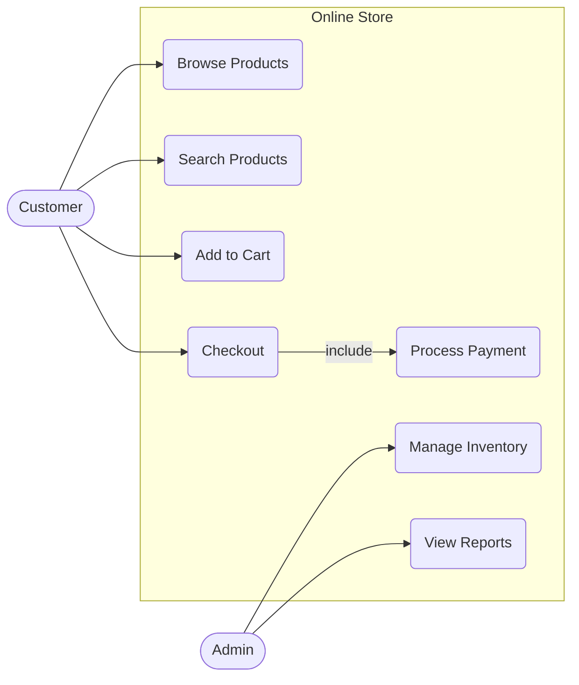

> **Tip:** Keep use cases as verb phrases from the user's perspective, not technical tasks.

---

## 4. Activity Diagram

**Use when:** Modeling workflows, business processes, or algorithms -- essentially a flowchart that shows the flow of control from one action to the next, including decisions and parallel paths.

```
flowchart TD
```

### Shapes

| Syntax | Shape | Meaning |
|---|---|---|
| `A([Start])` | Stadium / pill | Start or end node |
| `B[Action]` | Rectangle | A process step or action |
| `C{Decision}` | Diamond | A decision / branch point |
| `D[(Data Store)]` | Cylinder | Database or persistent storage |
| `E((Event))` | Circle | An event |
| `F[/Input/]` | Parallelogram | Input or output |

### Arrows

| Syntax | Meaning |
|---|---|
| `A --> B` | Unconditional flow |
| `A -->|label| B` | Conditional flow with guard label |
| `A -.-> B` | Dashed flow (optional or weak transition) |

### Flow Directions

| Code | Direction |
|---|---|
| `flowchart TD` | Top to bottom |
| `flowchart LR` | Left to right |
| `flowchart BT` | Bottom to top |
| `flowchart RL` | Right to left |

### Example

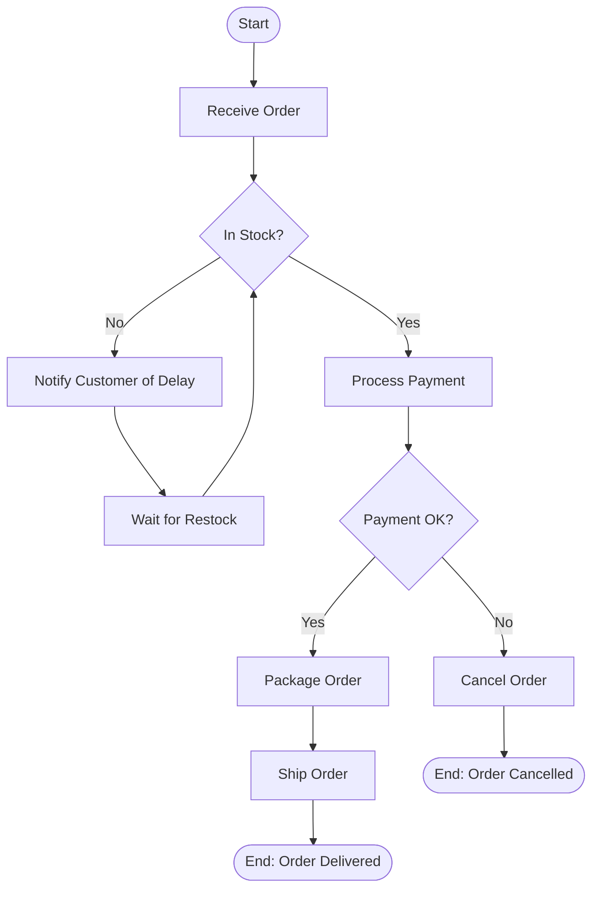

> **Tip:** For parallel flows (fork/join), use `flowchart` with subgraphs or just use multiple arrows from/to the same node.

---

## 5. State Diagram

**Use when:** Showing the different states an object or system can be in and the transitions between those states. Ideal for modeling UI components, order lifecycles, or any stateful entity.

```
stateDiagram-v2
```

### Syntax Elements

| Syntax | Meaning |
|---|---|
| `[*] --> StateName` | Transition from the initial state |
| `StateName --> [*]` | Transition to the final (end) state |
| `A --> B : event / action` | Transition from A to B triggered by event |
| `state "Label" as alias` | State with a display label |
| `state StateName { ... }` | Composite (nested) state |
| `[*] --> A` inside composite | Initial state inside a nested state |
| `--` | Divides concurrent regions (parallel states) |
| `<<fork>>` / `<<join>>` | Fork and join for concurrent flows |
| `note right of State : text` | Annotation on a state |

### Example

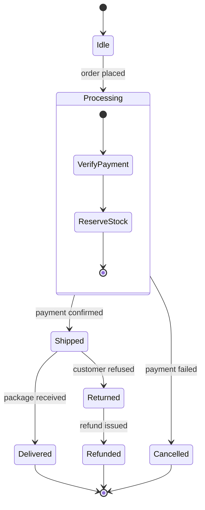

> **Tip:** Use `stateDiagram-v2` instead of `stateDiagram` -- v2 supports nested states and is the current standard.

---

## 6. Component Diagram

**Use when:** Illustrating how a system is split into components and how those components depend on or communicate with each other. Great for high-level architecture documentation.

> **Note:** Mermaid does not have a native Component diagram type. Use flowchart with subgraphs to simulate it.

```
flowchart TB
```

### Conventions for Components

| Element | Mermaid Syntax | Meaning |
|---|---|---|
| Component | `A[ComponentName]` | A discrete deployable unit or module |
| Interface / Port | `B((port))` | An exposed interface |
| Dependency | `A --> B` | A depends on B |
| Provided interface | `A -->|provides| B` | A provides an interface |
| Required interface | `A -->|requires| B` | A requires an interface |
| Subsystem | `subgraph Name` | Groups components into a package |

### Example

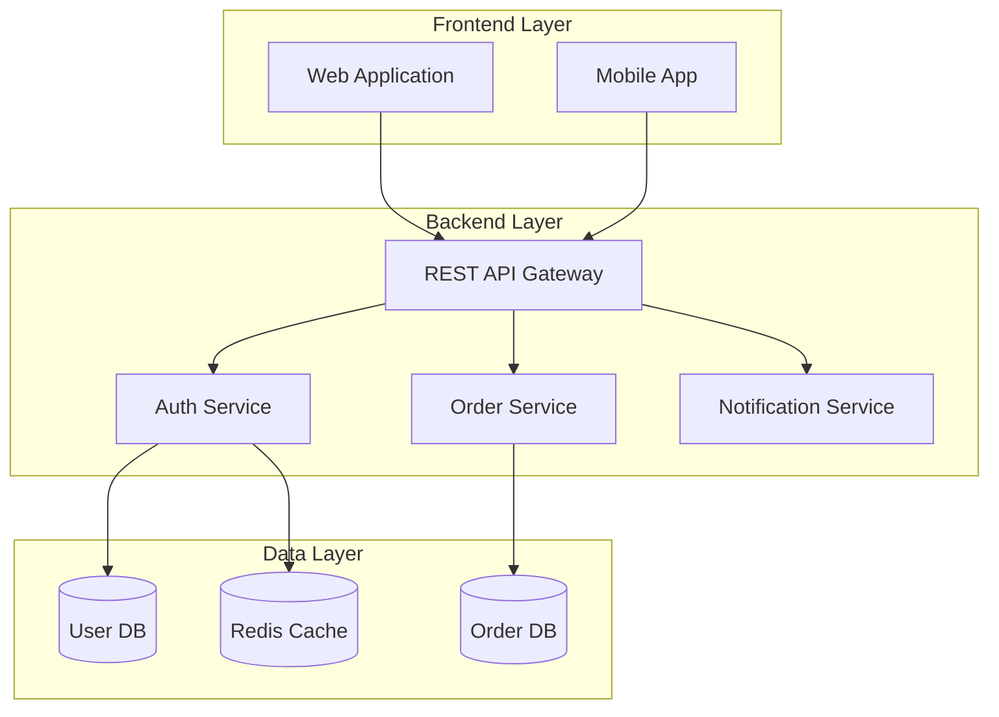

> **Tip:** Subgraphs are the key to making component diagrams readable. Group by layer, domain, or deployment boundary.

---

## 7. Entity Relationship Diagram

**Use when:** Modeling the data structure of a system -- what entities exist, what data they hold, and how they relate to each other. Essential for database design.

```
erDiagram
```

### Relationship Syntax

Relationships follow this pattern:

```
EntityA RELATIONSHIP EntityB : "label"
```

### Cardinality Symbols

| Left side | Right side | Meaning |
|---|---|---|
| `\|o` | `o\|` | Zero or one |
| `\|\|` | `\|\|` | Exactly one |
| `}o` | `o{` | Zero or many |
| `}\|` | `\|{` | One or many |

Full relationship examples:

| Syntax | Meaning |
|---|---|
| `A \|\|--\|\| B` | One and only one to one and only one |
| `A \|\|--o{ B` | One to zero or many |
| `A \|o--o{ B` | Zero or one to zero or many |
| `A }o--o{ B` | Zero or many to zero or many |

### Attribute Types

```
EntityName {
    type attributeName PK
    type attributeName FK
    type attributeName
}
```

Common types: `string`, `int`, `float`, `boolean`, `date`, `uuid`

### Example

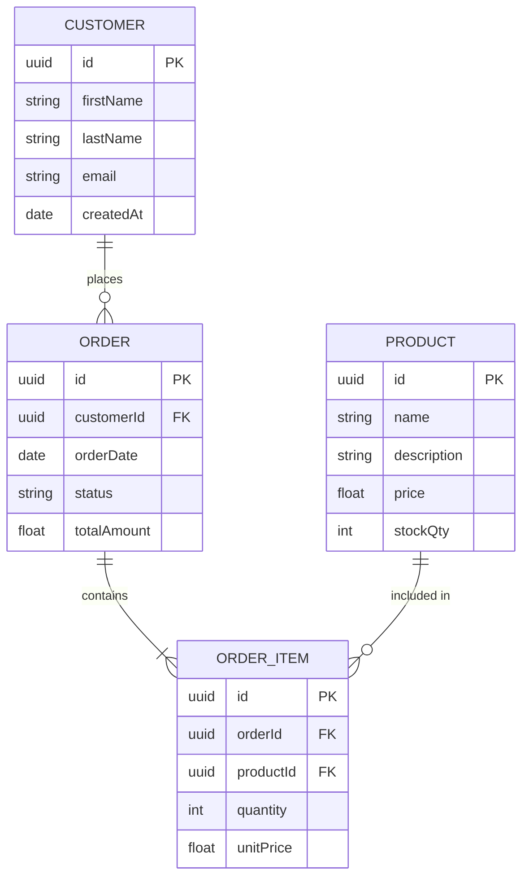

> **Tip:** Always label your relationships with a short verb phrase in quotes. It makes the diagram self-documenting.

---

## 8. Deployment Diagram (C4 Context)

**Use when:** Showing where software components are deployed -- servers, containers, cloud services. Use the C4 model approach with Mermaid flowcharts for architecture documentation.

> **Note:** Mermaid supports a `C4Context` diagram type. It is the closest to a UML Deployment diagram.

```
C4Context
```

### C4 Elements

| Syntax | Meaning |
|---|---|
| `Person(alias, "Label", "Desc")` | A human user |
| `System(alias, "Label", "Desc")` | The system being modeled |
| `System_Ext(alias, "Label", "Desc")` | An external system |
| `Container(alias, "Label", "Tech", "Desc")` | A container (app, DB, etc.) |
| `Boundary(alias, "Label") { ... }` | A system or deployment boundary |
| `Rel(A, B, "Label")` | Relationship from A to B |
| `Rel_Back(A, B, "Label")` | Relationship from B to A (drawn in reverse) |

### Example

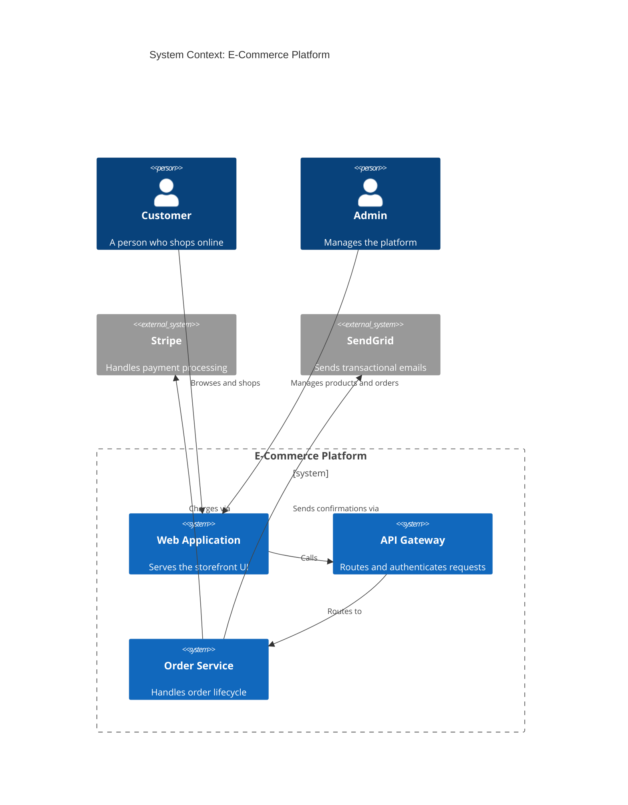

> **Tip:** C4 diagrams work best at one level of abstraction at a time. Do not mix system-level and container-level elements.

---

## 9. Timing Diagram

**Use when:** Showing how the state of one or more participants changes over time. Particularly useful for embedded systems, communication protocols, and real-time processes.

```
timeline
```

> **Note:** Mermaid's `timeline` diagram is the closest built-in option. For true UML timing diagrams, a workaround with `gantt` is common.

### Timeline Syntax

```
timeline
    title My Timeline
    section Phase Name
        Event label : description
        Another event : description
```

### Example (Timeline)

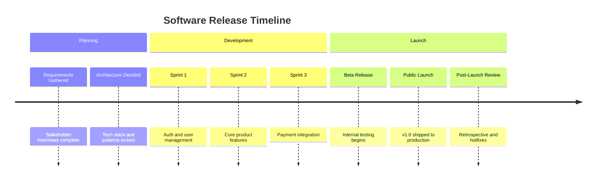

### Gantt-Based Timing Diagram

For more precise time-based state diagrams, use `gantt`:

```mermaid
gantt
    title System Process Timing
    dateFormat  HH:mm
    axisFormat %H:%M

    section Client
        Send Request       : 00:00, 1m
        Wait for Response  : 00:01, 3m
        Process Response   : 00:04, 1m

    section Server
        Receive Request    : 00:00, 1m
        Query Database     : 00:01, 2m
        Send Response      : 00:03, 1m

    section Database
        Execute Query      : 00:01, 2m
```

> **Tip:** Use `gantt` when you need precise durations and overlapping tasks. Use `timeline` when you want readable milestone-style documentation.

---

## 10. Quick Syntax Cheatsheet

### Diagram Type Declarations

| Diagram | Opening Keyword |
|---|---|
| Class | `classDiagram` |
| Sequence | `sequenceDiagram` |
| Activity / Use Case / Component | `flowchart TD` or `flowchart LR` |
| State | `stateDiagram-v2` |
| ER | `erDiagram` |
| C4 Context | `C4Context` |
| Timeline | `timeline` |
| Gantt | `gantt` |

### Universal Flowchart Arrow Reference

| Arrow | Syntax |
|---|---|
| Solid arrow | `A --> B` |
| Solid arrow with label | `A -->|label| B` |
| Dashed arrow | `A -.-> B` |
| Dashed arrow with label | `A -.->\|label| B` |
| Thick arrow | `A ==> B` |
| No arrowhead | `A --- B` |

### Universal Flowchart Shape Reference

| Shape | Syntax |
|---|---|
| Rectangle (process) | `A[Text]` |
| Stadium / pill | `A([Text])` |
| Diamond (decision) | `A{Text}` |
| Circle | `A((Text))` |
| Parallelogram (I/O) | `A[/Text/]` |
| Trapezoid | `A[/Text\]` |
| Cylinder (database) | `A[(Text)]` |
| Hexagon | `A{{Text}}` |
| Subroutine | `A[[Text]]` |

### Subgraph Syntax

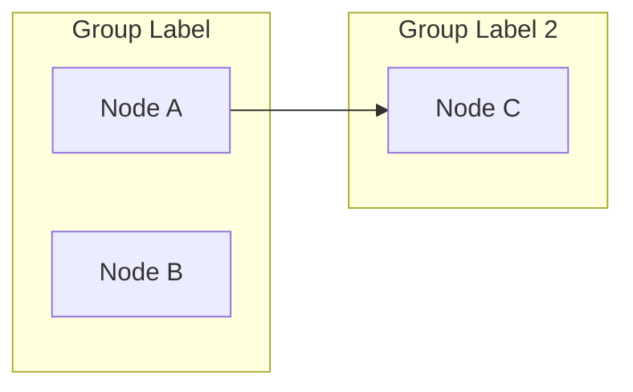

### Comments

```
%% This is a comment in any Mermaid diagram
```

---

> **General Tips**
>
> - Always wrap diagram code in triple backticks with `mermaid` as the language tag when embedding in Markdown.
> - Node IDs cannot contain spaces -- use camelCase or underscores.
> - Labels and descriptions can contain spaces when placed inside `[]`, `()`, `{}`, or quotes.
> - Special characters like `<`, `>`, `(`, `)` inside labels must be escaped or wrapped in quotes.
> - Keep diagrams focused -- one diagram per concern is better than one giant diagram covering everything.
