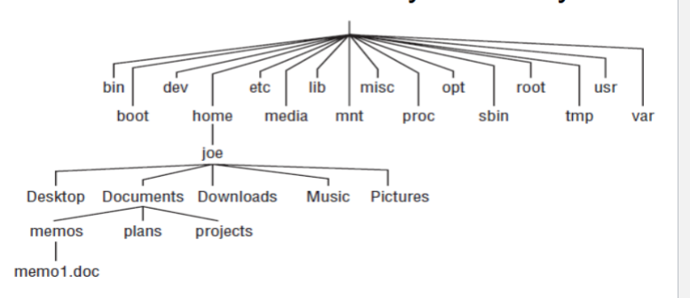

# CS2080 Midterm Study Guide

# WEEK 1: Intro to Linux / History

## Linux History (UNIX → Linux)

- **UNIX**: Created by Dennis Ritchie at Bell Labs. Later commercialized. GNU Public License (GPL) created.
- **Linux**: Linus Torvalds created GNU/Linux after BSD UNIX lost momentum. Still uses GNU Public License. Commonly called just Linux.

## Linux vs. Proprietary OS

Proprietary OS (Windows, macOS) **cannot**: view source code, modify core OS, audit for bugs/vulnerabilities. Linux **allows all of the above** (open source).

## Parts of the Linux System

| Component | Description |
| --- | --- |
| Bootloader | Manages the boot process |
| Kernel | Manages CPU, memory, peripheral devices — heart of the OS |
| Init System | Bootstraps user space; controls daemons (startup process) |
| Daemons | Software that runs as background services |
| Graphical Server | Subsystem that displays graphics |
| Desktop Environment | Graphical part of the user interface (GNOME, KDE, Xfce) |
| Applications | Programs the user runs |

> **What does “bootstrap user space” mean?** When Linux first starts, only the kernel is running — it manages hardware but can’t do anything useful for a user yet. “User space” is everything a user actually interacts with: services, login prompts, daemons, etc. The **Init System** (e.g. systemd) is the first process the kernel launches, and it then starts all the rest — network services, login managers, background daemons. This chain of starting processes from scratch is called “bootstrapping” (like pulling yourself up by your bootstraps). Example: kernel loads → init starts → init starts sshd (SSH daemon) → init starts getty (login prompt) → you can now log in.
> 

## Run Levels (used in class)

- **Run Level 2**: Multiuser mode, CLI only, **no** network services.
- **Run Level 3**: Extended multiuser mode, CLI only, **network services started**.

## Desktop Environments

- **GNOME** — default for Fedora/Red Hat; powerful & robust professional environment
- **KDE** (K Desktop) — 2nd most popular; emulates a Windows-like environment
- **Xfce** — lightweight, for older hardware
- **LXDE** — energy-saving, for low power devices

## Accessing the CLI

- **Shell prompt**: regular user ends in `$`, root user ends in `#`
- **Terminal window**: accessed from the GUI (right-click desktop or panel)
- **Virtual console**: multiple consoles available alongside the GUI; switch between them using **Ctrl+Alt+FunctionKey**

---

# WEEK 2: Bash Shell Commands

## Help Commands

```bash
help echo          # built-in help for shell commands
date --help        # help flag on external commands
info date          # detailed info pages
man date           # manual page
man -k date        # search manual pages by keyword
```

## Filesystem Navigation

Linux filesystem is an **upside-down tree** rooted at `/`. Each user gets a home under `/home/username`.



| Command | Action | Example |
| --- | --- | --- |
| `pwd` | Print current working directory | `pwd → /home/joe` |
| `cd` | Change directory | `cd /etc` or `cd ..` or `cd ~` |
| `cd` (no args) | Go to home directory | `cd` |
| `cd ~` | Go to home directory | `cd ~` |
| `cd ~/CS2080` | Go to subdirectory of home | `cd ~/CS2080` |
| `ls` | List files/directories | `ls -la` |
| `ls -a` | Show hidden files too | `ls -a` |
| `ls -l` | Long listing (permissions, owner, size) | `ls -l` |
| `ls -F` | Appends type indicator (/ for dirs) | `ls -F` |
| `ls -R` | Recursive listing | `ls -R` |
| `touch` | Create empty file or update timestamp | `touch newfile.txt` |

## Path Names

- **Absolute path**: Always starts with `/`. Full path from root. Ex: `cd /usr/share`
- **Relative path**: Never starts with `/`. Relative to current directory. Ex: `cd doc`
- `.` (single dot) = current directory
- `..` (two dots) = parent directory
- `~` = home directory
- `$HOME` = home directory variable

## File Matching Metacharacters (Globbing)

Used to refer to groups of files without typing every name. The shell expands them before running the command.

- — matches **any number** of characters (including zero)
    - `ls *.txt` → lists all .txt files
    - `rm file*` → deletes file, file1, file2, file_backup, etc.
    - `ls /etc/*.conf` → all .conf files in /etc
- `?` — matches exactly **one** character
    - `ls file?` → matches file1, fileA, fileX — but NOT file12 (two chars)
    - `ls ???.txt` → any .txt file with exactly a 3-character name
- `[...]` — matches **any one** character listed in the brackets
    - `ls file[123]` → matches file1, file2, or file3 only
    - `ls [a-z]*.txt` → .txt files starting with a lowercase letter
    - `ls [0-9]*` → files starting with any digit

## Common Linux Directories

| Directory | Purpose |
| --- | --- |
| `/bin` | Common Linux user commands |
| `/etc` | Administrative configuration files |
| `/home` | Regular user home directories |
| `/root` | Root user’s home (cannot access as regular user) |
| `/sbin` | Administrative commands |
| `/tmp` | Temporary files |
| `/var` | Variable data (logs, mail, etc.) |
| `/usr` | User-installed software |
| `/dev` | Device files |
| `/proc` | Virtual filesystem for process/kernel info |

## File Management Commands

| Command | Action | Example |
| --- | --- | --- |
| `cp src dst` | Copy file to new file/location | `cp file file.bck` |
| `mv src dst` | Move or rename a file | `mv file /home/joe/Docs/` or `mv file newfile` |
| `rm file` | Delete a file | `rm file` |
| `rm -r dir` | Delete non-empty directory recursively | `rm -r mydir` |
| `mkdir dir` | Create a directory | `mkdir newdir` |
| `rmdir dir` | Delete an **EMPTY** directory | `rmdir /home/joe/temp` |
| `ln file link` | Hard link (same filesystem, not dirs) | `ln file hardlink` |
| `ln -s file link` | Soft/symbolic link (can cross filesystems, point to non-existent) | `ln -s /etc/hosts mylink` |

### Hard Links vs. Symbolic (Soft) Links

**Hard link**: A second directory entry pointing to the **exact same data on disk** as the original. Both names are equal — deleting one does not delete the data, the other still works. Restrictions: cannot link to directories, cannot cross filesystem boundaries.

```bash
ln file hardlink        # hardlink and file now point to the same data
rm file                 # data still exists — hardlink still works
```

**Symbolic (soft) link**: A shortcut/pointer file that stores the **path** to the target. Like a Windows shortcut. Can point to directories, can cross filesystems, can even point to a file that doesn’t exist yet. If the original is deleted, the symlink becomes a “broken link.”

```bash
ln -s hello hello.sl    # hello.sl points to hello
rm hello                # hello.sl now broken (points to nothing)
echo "new" > hello      # recreate hello — hello.sl works again!
cat hello.sl            # → new
```

> **Key difference**: Hard link = same file, two names. Soft link = a pointer/shortcut to another path.
> 

## Viewing File Contents

```bash
cat file            # print file to screen
cat file1 file2     # concatenate both files
more file           # page through file (forward only)
less file           # page through file (forward AND backward)
head -n file        # show first n lines (default 10)
tail -n file        # show last n lines (default 10)
file filename       # identify file type (e.g. ASCII text, ELF binary)
```

## echo and Redirection (Writing Files)

```bash
echo "hello world" > hello    # write to file (OVERWRITE)
echo "more text" >> hello     # APPEND to file
```

## Managing Processes

| Command | Description |
| --- | --- |
| `ps` | Most common; lists running processes for current shell |
| `ps u` | Shows: username, PID, time started, CPU time |
| `ps ux` | All processes for the current user |
| `ps aux` | All processes for ALL users |
| `ps -e` | Show every running system process |
| `ps -o 'item1,item2'` | Show specific columns |
| `ps --sort=item` | Sort output by a specific field |
| `top` | Live interactive process viewer |
| `kill -signal PID` | Send signal to process by PID. Common: -15 (graceful), -9 (force) |
| `killall name` | Kill process(es) by name — use carefully! |

**top keyboard shortcuts**: `q`=quit, `M`=sort by memory, `P`=sort by CPU, `R`=reverse sort, `u`=filter by user, `1`=toggle CPUs, `K`=kill process (then enter PID, then 15 or 9)

**Signals**: represented by name (e.g. `SIGHUP`) OR number (e.g. `1`). **SIGKILL (9) and SIGSTOP cannot be blocked** by any process — they always work.

```bash
kill 10432          # default signal = 15 (SIGTERM, graceful)
kill -15 10432      # explicit SIGTERM
kill -SIGKILL 10432 # force kill by name
killall -9 testme   # force kill all processes named "testme"
```

## Disk Commands: `mount`, `umount`, `df`, `du`

### What Does Mounting Mean?

In Linux, there are no drive letters (no C:, D:). Instead, every storage device (hard drive partition, USB, CD) must be **attached to a directory** in the filesystem tree before you can use it. This attachment is called **mounting**. The directory it attaches to is called the **mount point**.

- **Mounting** = connecting a storage device to a directory so files on it become accessible under that path.
- **Unmounting** = safely disconnecting it. You must unmount before physically removing a USB drive.
- `/etc/fstab` = the config file that tells Linux what to mount automatically at boot.

```bash
mount                       # show everything currently mounted
mount /dev/sdb1 /mnt/usb   # temporarily mount a partition to /mnt/usb
umount /mnt/usb             # detach it (or umount /dev/sdb1)
```

> **Why unmount?** The OS may buffer writes. Unmounting flushes those buffers to disk safely. Yanking a USB without unmounting can corrupt files.
> 

```bash
df                  # show disk space on all mounted filesystems
df -h               # human readable sizes (KB/MB/GB)
df -a               # include special filesystems with no space (like /proc)
df -i               # show inode usage instead of block usage
df -t TYPE          # show only filesystems of a specific type (e.g. -t ext4)
df -x TYPE          # exclude filesystems of a specific type
df --block-size=#   # display in specific block size
du                  # show disk usage of current directory and subdirectories
du -h               # human readable
du -h $HOME         # show home directory usage
```

## `Sort`, `WC`, `Grep`, `Gzip`, `Tar`

```bash
sort file | head -5         # sort and show top 5 lines
wc -l file                  # count lines
wc -c file                  # count bytes/chars
grep 'pattern' file         # search for pattern in file
grep -i 'pattern' file      # ignore case
grep -l 'pattern' dir/      # list filenames with match
grep -r 'pattern' dir/      # recursive search
grep -v 'pattern' file      # lines NOT matching (invert)
gzip file                   # compress file
tar cvf archive.tar dir/    # create tarball
tar xvf archive.tar         # extract tarball
tar czf archive.tar.gz dir/ # create compressed tarball
tar xzf archive.tar.gz      # extract compressed tarball
```

---

# WEEK 3: Subshells & Variables

## What Is a Process?

A **process** is a **running instance of a command**. Every time you run a program, the OS creates a process for it. It has its own process ID (PID), memory space, and state. You can have multiple processes of the same program running at the same time, each is its own separate instance.

## Shell Activity: Foreground vs. Background

**The shell SLEEPS while a command is executing in the foreground.** You cannot type another command until the foreground command finishes.

- **Foreground**: shell waits. You must wait for it to finish.
- **Background** (`&`): shell does NOT wait. You get your prompt back immediately and can keep working.

```bash
sleep 10        # foreground — shell sleeps 10 seconds, you wait
sleep 10 &      # background — shell returns immediately, sleep runs separately
```

> This is why `&` is so useful: it lets you run long tasks (backups, compiles) without being stuck waiting.
> 

## Parent / Child Shell Relationship

When you open a terminal you get a **parent shell**. Some commands launch **child (sub) shells**.

- `(commands)` — runs commands in a **subshell** (child). Variables set inside do NOT affect the parent.
- `{ commands; }` — runs commands in the **current shell** (no child created).
- `coproc` — runs a command in a background subshell with two-way communication.

```bash
exit                    # exit the current shell/subshell
jobs                    # list background jobs in current shell
sleep 10 &              # run sleep in background (returns prompt immediately)
which command           # shows the full path to an external command (e.g. which ls → /bin/ls)
type command            # identifies command type: builtin, external, alias, or function
history                 # shows list of previously entered commands
!n                      # re-run command number n from history
!!                      # re-run the previous command
!?string?               # re-run most recent command containing 'string'
alias ll='ls -la'       # create a short name for a longer command
alias rm='rm -i'        # make rm always prompt before deleting
```

> **type vs. which**: `type` tells you WHAT a command is (builtin/alias/function/file). `which` tells you WHERE an external command lives on disk. Linux does **not** check the current directory for commands only directories in `$PATH` are searched.
> 

## Environment Variables

**Two categories of variables:**
- **Environment variables**: UPPER CASE by convention. Set at login, valid for the whole session. Inherited by child shells. More “permanent” (e.g. `HOME` rarely changes).
- **Shell variables**: lower case by convention. Apply only to the current shell instance. Temporary/local (e.g. `PWD` changes every `cd`).

To make a shell variable into an environment variable (so child shells inherit it), use `export`.

```bash
printenv                # print all environment variables
printenv HOME           # print specific variable
env                     # print environment (variables exported to new shells)
set                     # show ALL shell variables (local + environment)
unset VARNAME           # remove a variable
export VARNAME          # make variable available to child processes
echo $PATH              # print PATH variable
```

### Common Variables Reference

| Variable | What It Stores | Example Value |
| --- | --- | --- |
| `$HOME` | Your home directory path | `/home/joe` |
| `$USER` | Your username | `joe` |
| `$SHELL` | Path to your login shell | `/bin/bash` |
| `$PWD` | Current working directory (changes on every `cd`) | `/home/joe/CS2080` |
| `$PATH` | Colon-separated list of directories searched for commands | `/usr/bin:/bin:/usr/local/bin` |
| `$PS1` | Configures the shell prompt appearance | `[\u@\h \W]\$` |
| `$MAIL` | Location of your mailbox file | `/var/mail/joe` |
| `$HISTSIZE` | How many commands history remembers | `1000` |

> **PATH explained**: When you type `ls`, bash searches each directory in `$PATH` left to right until it finds an `ls` executable. Linux **never** automatically checks the current directory — that’s why you need `./myscript` to run a script in the current dir.
> 

> **Persist environment variables**: Add `export VARNAME=value` to your `~/.bashrc` file so it’s set every time you log in.
> 

## Variable Arrays

```bash
myarray=(one two three)     # define an array
echo ${myarray[0]}          # access element at index 0 → "one"
echo ${myarray[@]}          # all elements
echo ${#myarray[@]}         # number of elements
myarray[3]=four             # add/set element at index 3
unset myarray[1]            # remove element at index 1
```

## Brace Expansion

Allows expansion of a character or set of characters across filenames/strings.

```bash
touch memo{1,2,3,4}         # creates: memo1 memo2 memo3 memo4
echo {a,b,c}.txt            # → a.txt b.txt c.txt
```

## readonly Variables

Once a variable is marked `readonly`, it cannot be changed or unset.

```bash
person=zach
readonly person
person=helen        # ERROR: person is readonly
```

## Aliases

Aliases are short names (shortcuts) for longer commands. They override external commands with the same name.

```bash
alias rm='rm -i'                    # make rm always prompt before deleting
alias ll='ls -l'                    # short alias for long listing
alias mypwd1="echo pwd is$PWD"     # double quotes: $PWD evaluated NOW at alias creation time
alias mypwd2='echo pwd is $PWD'     # single quotes: $PWD evaluated LATER when alias is run
```

> **Double vs single quotes in aliases**: Use double quotes if you want the variable value captured at the moment you create the alias. Use single quotes if you want it evaluated fresh each time you run the alias.
> 

---

# WEEK 4: Permissions, Filesystems & Software Management

## Linux Permission Model

Permissions are **9 bits** in 3 groups: **[owner][group][others]**, each being **rwx**.

| Symbol | Numeric | Meaning for File | Meaning for Directory |
| --- | --- | --- | --- |
| `r` | 4 | Read file contents | List directory contents |
| `w` | 2 | Modify/delete file | Add/remove files in dir |
| `x` | 1 | Execute as program | Enter dir / search it |
| `-` | 0 | No permission | No permission |

> **Permission Number** = r(4) + w(2) + x(1). Example: `rwxrw-r--` = **764** because (4+2+1)(4+2+0)(4+0+0) = 764
> 

## chmod — Change Permissions

```bash
chmod 700 file      # numeric: owner=rwx, group=---, others=---
chmod 777 file      # rwxrwxrwx (full access all)
chmod 644 file      # rw-r--r-- (typical file)
chmod 755 dir       # rwxr-xr-x (typical directory)
chmod a+x file      # add execute for ALL (u/g/o). +/- to add/remove
chmod u+x,g-w file  # multiple letter changes at once
```

**Letter bits**: `u`=user/owner, `g`=group, `o`=other, `a`=all

### chmod Quick Reference

| Number | Permission | Number | Permission |
| --- | --- | --- | --- |
| `777` | rwxrwxrwx (all access) | `644` | rw-r–r– (typical file) |
| `755` | rwxr-xr-x (typical dir) | `600` | rw——- (private file) |
| `700` | rwx—— (owner only) | `400` | r——– (read only, owner) |
| `666` | rw-rw-rw- (base file default) | `000` | ——— (no permissions) |

## Default Permissions & umask

- Base defaults: file = **666** (rw-rw-rw-), directory = **777** (rwxrwxrwx)
- The **umask** is subtracted from defaults.
- umask=0022 → file becomes 644, dir becomes 755
- umask=0002 → file becomes 664, dir becomes 775

```bash
umask           # view current umask
umask 0022      # set umask
```

## chown: Change Ownership

```bash
chown joe memo.txt          # change owner to joe
chown joe:joe memo.txt      # change owner AND group to joe
```

> Regular users cannot change ownership of others’ files. Root can change any file’s ownership.
> 

## User Management

```bash
useradd username            # create new user (requires root)
useradd -m username         # create user with home directory
usermod                     # modify existing user (mirrors useradd options)
userdel christine           # delete user account
userdel -r christine        # delete user AND their home directory
passwd username             # set/change password
```

### useradd Options

| Option | Description |
| --- | --- |
| `-c 'Full Name'` | Comment / full name |
| `-d home_dir` | Home directory |
| `-e YYYY-MM-DD` | Account expiration date |
| `-g group` | Primary group |
| `-G group1,group2` | Supplemental groups |
| `-m` | Auto-create home directory |
| `-M` | Do NOT create home directory |
| `-p password` | Encrypted password |
| `-s /bin/bash` | Login shell |
| `-u UID` | Specify user ID number |

```bash
useradd -D                          # display current defaults
useradd -D -b /home/everyone        # change default home directory
```

**Default files**: `/etc/login.defs` (PASS_MAX_DAYS, PASS_MIN_DAYS, PASS_MIN_LENGTH) and `/etc/default/useradd`

## Group Management

Every user has a **primary group** (same name as user in Fedora/RHEL). Stored in `/etc/group`.
- Special Admin Group IDs: 0–499 (or 0–999). Regular groups start at 500 or 1000.

```bash
groupadd kings              # create group
groupadd -g 325 jokers      # create with specific GID
groupmod                    # modify group
newgrp groupname            # temporarily join a group
chgrp groupname file        # change group ownership of file
```

## Access Control Lists (ACLs)

ACLs let regular users share files/dirs selectively beyond standard rwx.

```bash
setfacl -m u:username:rwx file          # add ACL for a specific user
setfacl -m g:groupname:rw file          # add ACL for a specific group
setfacl -x u:username file              # remove ACL permission
getfacl file                            # view a file's ACLs (+ in ls -l = ACLs set)
setfacl -m d:g:market:rwx /tmp/mary/    # set DEFAULT ACL on directory (inherited)
```

**ACL permission types**: `user`, `user:name`, `group`, `group:name`, `mask` (max allowed), `other`

## Filesystems & Partitioning

### What Is Partitioning?

A physical hard drive is one big piece of storage. **Partitioning** divides it into separate, isolated sections called **partitions**. Each partition acts like its own independent disk. Benefits: you can put the OS on one partition, user files on another, if one fills up or gets corrupted, the others are unaffected.

**Workflow**: Physical disk → divide into partitions (with `fdisk`) → format each partition into a filesystem (with `mkfs`) → mount each partition to a directory → use it.

```
Physical Disk /dev/sda
  ├── /dev/sda1  →  formatted as ext4  →  mounted as /        (root)
  ├── /dev/sda2  →  formatted as swap  →  used as swap space
  └── /dev/sda3  →  formatted as ext4  →  mounted as /home
```

### Supported Linux Filesystem Types

| Filesystem | Description |
| --- | --- |
| **ext2** | Older Linux filesystem, no journaling |
| **ext3** | ext2 + journaling (crash recovery). Very common. |
| **ext4** | Current standard Linux filesystem. Faster, larger file support. |
| **swap** | Not a real filesystem — used as virtual RAM overflow |
| **VFAT** | Windows FAT filesystem — Linux can read/write it (useful for USB drives) |
| **NTFS** | Windows primary filesystem — Linux can support it with additional kernel drivers |

> **Linux vs Windows storage**: Windows uses drive letters (C:, D:). Linux fits everything into ONE directory tree starting at `/` — different partitions are mounted at different points in that tree.
> 

> **ACLs require**: ext2, ext3, or ext4 with the `acl` mount option enabled.
> 

```bash
fdisk -l                # list disk partitions (-u shows sectors, -c turns off DOS compat)
mkfs                    # format a partition (e.g. mkfs.ext4 /dev/sdb1)
fsck                    # check/repair filesystem
mount                   # show or mount a filesystem
```

**fdisk interactive options**: `d`=delete partition, `n`=new partition, `p`=show current partitions, `t`=set type (8e=Linux LVM, 82=swap, FAT32=b), `w`=write changes and exit

**Partition types (fdisk `t` command)**:
- Linux = standard
- Linux LVM = `8e`
- swap = `82`
- FAT32 = `b`

## Logical Volume Management (LVM)

LVM is more flexible than traditional partitioning: resize volumes on-the-fly, mirror data, move data between physical volumes while in use.

| LVM Concept | Description |
| --- | --- |
| Physical Volume (PV) | A disk partition designated for LVM |
| Volume Group (VG) | Pool of storage made from one or more PVs |
| Logical Volume (LV) | Flexible “partition” carved from a VG |

```bash
# Physical Volume commands
pvcreate /dev/sdb1
pvdisplay

# Volume Group commands
vgcreate vgname /dev/sdb1
vgdisplay
vgextend vgname /dev/sdc1
vgreduce vgname /dev/sdb1
vgremove vgname
vgchange

# Logical Volume commands
lvcreate -L 10G -n lvname vgname
lvdisplay
lvextend -L +5G /dev/vgname/lvname
lvremove /dev/vgname/lvname
```

## Software Management

- **Tarball**: single archive of multiple files. Weaknesses: no dependency tracking, no easy removal, no update mechanism.
- **DEB packaging**: Debian-based distros (Ubuntu).
- **RPM packaging**: Red Hat-based (Fedora, RHEL — what we use).

### RPM Commands

```bash
rpm -q firefox      # query: is package installed?
rpm -qi firefox     # detailed package info
```

> RPM drawback: must handle dependencies manually; must provide exact file path.
> 

### YUM Commands (Red Hat package manager)

YUM manages packages from **repositories**, auto-handles dependencies, only needs package name.

**How YUM works — phases when you run `yum install`:**
1. Checks `/etc/yum.conf` (main config)
2. Checks `/etc/sysconfig/rhn/up2date` (RHEL only)
3. Checks `/etc/yum.repos.d/*.repo` files (repository locations)
4. Downloads RPM packages and metadata from the repository
5. Installs RPM packages to the Linux filesystem
6. Stores repository metadata in the local RPM database

| Command | Description |
| --- | --- |
| `yum install packagename` | Install package and all dependencies |
| `yum reinstall packagename` | Reinstall a package (useful if you accidentally deleted parts of it) |
| `yum erase packagename` | Remove/uninstall a package |
| `yum update packagename` | Update a specific package |
| `yum update` | Update all packages |
| `yum check-update` | List packages with available updates |
| `yum search name` | Search repos for packages matching name/description |
| `yum info packagename` | Show package details |
| `yum provides libraryname` | Find which package provides a file/command/library |
| `yum list packagename` | Show version and repo for a package |
| `yum list available` | All available packages |
| `yum list installed` | All installed packages |
| `yum list all` | All packages (installed + available) |
| `yum deplist packagename` | Show what a package depends on |
| `yum history` | Show all past yum transactions |
| `yum grouplist` | Show all available software package groups |
| `yum groupinfo groupname` | Detailed info about a package group |
| `yum groupinstall groupname` | Install an entire package group at once |
| `yum groupremove groupname` | Remove an entire package group |
| `yum clean packages` | Remove unneeded downloaded package files |
| `yum clean metadata` | Delete unneeded metadata from `/var/cache/yum` |
| `yum check` | Review RPM database for errors |
| `yum clean rpmdb` | Clean out and rebuild the RPM database |
| `yumdownloader packagename` | Download RPM from repo but do NOT install it |

> `apt-get` / `aptitude`: equivalent package managers for Debian/Ubuntu. `make`: builds software from source code.
> 

> **Package groups**: A group is a collection of related packages (e.g. “Virtualization” group contains everything needed to set up a virtual host). Managing groups is easier than tracking individual packages.
> 

---

# WEEK 5: Editors & Basic Scripts

## Vim Editor - Modes

vim always starts in **Command Mode**. You must enter **Input Mode** to type text. Press **ESC** to return to command mode.

```bash
vim filename    # open file in vim
vimtutor        # interactive vim tutorial
```

### Vim Input Commands (enter Input Mode)

| Key | Action |
| --- | --- |
| `a` | Append after cursor |
| `A` | Append at end of line |
| `i` | Insert before cursor |
| `I` | Insert at beginning of line |
| `o` | Open new line below |
| `O` | Open new line above |
| `ESC` | Return to Command Mode |

### Vim Navigation (Command Mode)

`Arrow keys`, `w`/`b` (word forward/back), `W`/`B` (with punctuation), `0` (line start), `$` (line end), `H`/`M`/`L` (top/middle/bottom of screen), `G` (last line), `1G` (first line), `Ctrl+f`/`b` (page fwd/back), `Ctrl+d`/`u` (half page fwd/back)

### Vim Editing Commands

| Key | Action |
| --- | --- |
| `x` / `X` | Delete char under / before cursor |
| `dd` | Delete current line |
| `3dd` | Delete next 3 lines |
| `dw` | Delete word after cursor |
| `db` | Delete word before cursor |
| `yy` | Copy (yank) current line to buffer |
| `p` / `P` | Paste buffer after / before cursor |
| `u` | Undo last change |
| `Ctrl+R` | Redo |
| `cc` / `cl` | Erase line/char and enter input mode |
| `/word` | Search forward for ‘word’ |
| `?word` | Search backward |
| `n` / `N` | Next / previous search result |
| `ZZ` | Save and quit |
| `:w` | Save |
| `:wq` | Save and quit |
| `:q` | Quit (no changes) |
| `:q!` | Quit without saving |
| `:! cmd` | Run shell command from within vim |
| `Ctrl+G` | Show file name and position info |

## Other Editors

- **nano** - simple, hints shown at bottom of screen
- **emacs** - powerful, extensible
- **Graphical editors** - gedit, kate, etc.

## Shell Scripts - Basics

A shell script is a plain-text file containing commands, functions, and variables that can be run as a program. Used to automate tasks (like batch files in DOS).

### Executing Scripts

```bash
bash myscript           # run using bash directly (no execute bit needed)
./myscript              # run as program — requires BOTH:
                        #   1) First line = #!/bin/bash
                        #   2) Execute bit set: chmod +x myscript
```

### Debugging Scripts

```bash
bash -x myscript        # print each command as it executes
set -x                  # enable debug mode inside a script
echo $?                 # check exit status of last command (0 = success)
```

### Linux Exit Status Codes

| Code | Meaning |
| --- | --- |
| `0` | Successful completion |
| `1` | General unknown error |
| `2` | Misuse of shell command |
| `126` | Command can’t execute |
| `127` | Command not found |
| `128` | Invalid exit argument |
| `128+x` | Fatal error with signal x |
| `130` | Terminated with Ctrl+C |
| `255` | Exit status out of range |

## Variables in Scripts

Variable names are **case-sensitive**. Assign with `=` (no spaces). Reference with `$`.

```bash
NAME=value                  # assign (no spaces around =)
GREETING="Hello World"      # string assignment
TODAY=$(date)               # assign output of a command to variable
echo $NAME                  # reference variable
echo ${NAME}                # explicit reference (same result)
```

Escape special chars: precede with `\` or surround with single quotes to prevent shell interpretation.

### Variable Expansion (Advanced)

```bash
${var:-value}       # if var is unset/empty, use value (doesn't set var)
${var#pattern}      # remove shortest match of pattern from FRONT
${var##pattern}     # remove longest match from FRONT
${var%pattern}      # remove shortest match fromEND
${var%%pattern}     # remove longest match fromEND
```

## OUTPUT REDIRECTION & PIPES

This is one of the most important topics. Every command produces output. Redirection controls **where** that output goes.

### Three Standard File Descriptors

Every process in Linux has three default communication channels, each identified by a number called a **file descriptor (fd)**:

- **stdin (fd 0)**: standard input — where the process reads input from (keyboard by default)
- **stdout (fd 1)**: standard output — where the process sends normal output (screen by default)
- **stderr (fd 2)**: standard error — where the process sends error messages (screen by default)

**What is a file descriptor?** It’s just a number that represents an open “channel” for a process to read/write. File descriptors 0, 1, 2 are pre-assigned. You can create your own (3–8) in scripts to redirect to/from additional files simultaneously.

```bash
# Advanced: using custom file descriptors in a script
exec 3>testout                  # open fd 3 pointing to the file "testout"
echo "This goes to screen"      # stdout (fd 1) = screen as normal
echo "This goes to file" >&3    # redirect this line to fd 3 → testout
exec 3>&-                       # close fd 3 when done
```

> fd 0=stdin, 1=stdout, 2=stderr and the redirection operators that use them (`2>`, `1>`, `2>&1`).
> 

### Redirection Operators

| Symbol | Name | What it does | Example |
| --- | --- | --- | --- |
| `>` | Redirect stdout (overwrite) | Sends stdout to a file, **replacing** contents | `echo "hi" > file.txt` |
| `>>` | Redirect stdout (append) | Sends stdout to file, **adding** to existing contents | `echo "more" >> file.txt` |
| `<` | Redirect stdin | Feeds a file as input to a command | `sort < unsorted.txt` |
| `2>` | Redirect stderr | Sends error messages to a file | `ls badfile 2> errors.txt` |
| `2>>` | Append stderr | Appends error messages to file | `cmd 2>> errors.txt` |
| `1>` | Redirect stdout (explicit) | Same as `>`, explicit about fd 1 | `cmd 1> out.txt` |
| `&>` | Redirect stdout + stderr | Sends BOTH stdout and stderr to same file | `cmd &> all.txt` |
| `2>&1` | Redirect stderr to stdout | Merges stderr INTO stdout stream | `cmd > out.txt 2>&1` |
| `\|` | Pipe | Connects stdout of one command to stdin of the next | `ls \| grep txt` |

> **Key insight**: `>` and `>>` only redirect stdout. Errors still appear on screen unless you also redirect stderr with `2>`.
> 

### Redirection Examples

```bash
ls /baddir > out.txt 2>&1       # stdout AND stderr both go to out.txt
                                 # (order matters: redirect stdout first, then merge stderr)
cmd &> all.txt                  # shorthand: both stdout and stderr to all.txt
ls | sort | head -5             # pipe chain: list → sort → show top 5
cat file1 file2 > combined.txt  # combine two files into one
```

## /dev/null - Throwing Away Output

`/dev/null` is a special device file that **discards everything written to it**. Like a black hole.

```bash
cmd > /dev/null         # discard stdout (suppress normal output)
cmd 2> /dev/null        # discard stderr (suppress error messages)
cmd &> /dev/null        # suppress ALL output (both stdout and stderr)
```

> Common use: run a command silently in a script without cluttering the terminal.
> 

## tee - Creating Log Files

`tee` reads from stdin and writes to BOTH stdout (screen) AND a file simultaneously — like a T-junction in a pipe.

```bash
cmd | tee file.txt          # see output on screen AND save to file.txt (overwrites)
cmd | tee -a file.txt       # see output AND APPEND to file.txt
ls | tee output.txt | grep txt   # tee in the middle of a pipe chain
./script.sh 2>&1 | tee logfile.txt   # log both stdout and stderr while still seeing output
```

## Math in Scripts

```bash
expr 1 + 5              # integer arithmetic (spaces required around operators) → 6
var1=$[1+5]             # bracket notation for integer math
expr 5 / 2              # → 2 (integers only, truncates decimal)

# bc — bash calculator (supports floating point)
var1=$(echo "scale=4; 3.44 / 5" | bc)   # scale= sets decimal places
echo $var1                               # → .6880

# bc inline redirection
variable=$(bc << EOF
scale=4
3.44 / 5
EOF
)
```

---

# WEEK 6: Structured Commands (if / case / loops)

## if-then Statement

```bash
# Basic if-then
if [ test condition ]; then
    commands
fi

# if-then-else
if [ test condition ]; then
    commands
else
    commands
fi

# if-then-elif-else
if [ cond1 ]; then
    commands
elif [ cond2 ]; then
    commands
else
    commands
fi
```

> `fi` is “if” backwards — marks end of if block.
> 

### One-line if Shortcuts

```bash
[ condition ] && command    # run command only if condition is TRUE
[ condition ] || command    # run command only if condition is FALSE
```

## Test Conditions - Comparison Operators

### Numeric Comparisons (use inside `[ ]`)

| Operator | Meaning |
| --- | --- |
| `-eq` | equal |
| `-ne` | not equal |
| `-gt` | greater than |
| `-ge` | greater than or equal |
| `-lt` | less than |
| `-le` | less than or equal |

### String Comparisons

| Operator | Meaning |
| --- | --- |
| `=` | equal (string) |
| `!=` | not equal (string) |
| `>` | greater than (alphabetic) |
| `<` | less than (alphabetic) |
| `-n string` | string length > 0 (not empty) |
| `-z string` | string length = 0 (empty) |

### File Test Operators

| Operator | What Is Being Tested |
| --- | --- |
| `-a file` / `-e file` | File exists |
| `-f file` | File exists and is a regular file (not dir/link/device) |
| `-d file` | Is a directory |
| `-b file` | Is a block special device |
| `-c file` | Is a character special device |
| `-h file` / `-L file` | Is a symbolic link |
| `-g file` | Has set-group-id (SGID) bit set |
| `-k file` | Has sticky bit set |
| `-n string` | String length > 0 |
| `-O file` | You own the file |
| `-r file` | File is readable |
| `-w file` | File is writable |
| `-x file` | File is executable |
| `-s file` | File exists and has size > 0 |

### Compound Conditions

```bash
if [ cond1 ] && [ cond2 ]; then     # BOTH must be true
if [ cond1 ] || [ cond2 ]; then     # EITHER can be true
```

## Double Brackets and Parentheses

### `[[ ]]` — Extended test command

More powerful than `[ ]`. Supports pattern matching and regex.

```bash
[[ $str == he* ]]           # test if string starts with 'he' (pattern matching)
[[ $str =~ ^[0-9]+$ ]]      # regex match: test if string is all digits
[[ $str != *foo* ]]         # string does NOT contain 'foo'
```

### `(( ))` — Arithmetic evaluation

Use math operators directly without `-eq` etc.

```bash
if (( $var1 ** 2 > 90 )); then      # test if var1 squared > 90
    echo "large"
fi
(( count++ ))                        # increment counter
if (( $a > $b )); then echo "a wins"; fi   # numeric comparison with math syntax
```

## case Statement

Replaces multiple nested ifs. Similar to `switch` in other languages. `esac` is “case” backwards.

```bash
case $NUMBER in
    1)  echo "The number is 1" ;;
    2)  echo "The number is 2" ;;
    10) echo "The number is 10" ;;
    *)  echo "Not 1, 2, or 10" ;;   # *) is the catch-all (default)
esac
```

> Each result ends with `;;` (double semicolon). `esac` marks the end.
> 

## Loops

### for…do - iterate over a list

```bash
for NUMBER in 0 1 2 3 4 5
do
    echo The number is $NUMBER
done

# Iterate over files
for file in $(ls *.txt)
do
    echo Processing $file
done
```

> **IFS** (Internal Field Separator): controls how bash splits words in a for loop. Default: space, tab, newline.
> 

### while…do - execute WHILE condition is true

```bash
N=0
while [ $N -lt 10 ]
do
    echo The number is $N
    let N=$N+1
done
```

### until…do - execute UNTIL condition becomes true

```bash
N=0
until [ $N -eq 10 ]
do
    echo The number is $N
    let N=$N+1
done
```

### break and continue

```bash
# break — exits the loop immediately
for NUMBER in 0 1 2 4 8 9
do
    if [ $NUMBER = 8 ]; then
        break
    fi
    echo The number is $NUMBER
done

# continue — skips rest of current iteration, goes to next
for NUMBER in 0 1 2 4 8 9
do
    if [ $NUMBER = 8 ]; then
        continue
    fi
    echo The number is $NUMBER
done
```

### Redirecting Loop Output

```bash
for i in 1 2 3; do echo $i; done > output.txt  # redirect all loop output to file
for i in 1 2 3; do echo $i; done | sort        # pipe all loop output to sort
```

---

# WEEK 7: User Input, Output & Advanced Redirection

## Passing Parameters to Scripts

| Variable | Description | Example |
| --- | --- | --- |
| `$0` | Name of the script itself | `./myscript.sh → $0 = ./myscript.sh` |
| `$1, $2 ... $9` | Positional parameters (first 9 args) | `./script hello world → $1=hello $2=world` |
| `${10}` | 10th parameter and beyond (curly braces required) | `${10}, ${11}` |
| `$#` | Number of parameters passed | `if [ $# -ne 2 ]; then echo "Need 2 args"; fi` |
| `$*` | All parameters as ONE string | `"$*" = "$1 $2 $3"` |
| `$@` | All parameters as SEPARATE quoted strings (preferred in loops) | `for arg in "$@"; do` |
| `-n $1` | Test: parameter is not empty | `[ -n $1 ]` |

## shift - Being Shifty

`shift` moves all parameters down one position: `$2` becomes `$1`, `$3` becomes `$2`, etc. `$1` is discarded. Used to process an unknown number of arguments in a loop.

```bash
while [ $# -gt 0 ]; do
    echo Arg: $1
    shift
done
```

## getopt / getopts — Processing Options

**What does getopt/getopts do?** When you run a command like `ls -la` or `grep -i -r pattern dir/`, the `-l`, `-a`, `-i`, `-r` are **options** (flags). `getopt`/`getopts` is what lets YOUR scripts accept and process those same kinds of flags cleanly, without you having to manually parse `$1`, `$2`, etc.

**Why use it instead of just using $1/$2?** Because options can come in any order (`-a -b` vs `-b -a`), can be combined (`-ab`), and some options take arguments (`-f filename`). Doing that by hand is messy. `getopts` handles all of it.

**getopts** is the built-in bash version (preferred). The option string `ab:c` means:
- `a` — simple flag, no argument
- `b:` — requires an argument (the `:` means “takes a value”)
- `c` — simple flag, no argument

```bash
# Script that accepts -a, -b value, -c flags
while getopts :ab:c opt
do
    case $opt in
        a) echo "Option -a was used" ;;
        b) echo "Option -b was used with value:$OPTARG" ;;
        c) echo "Option -c was used" ;;
        ?) echo "Unknown option:$opt" ;;
    esac
done

# Running it:
# ./myscript -a -b hello -c
# → Option -a was used
# → Option -b was used with value: hello
# → Option -c was used
```

> `$OPTARG` automatically holds the argument value for options that require one (like `-b` above). `$OPTIND` tracks which argument position getopts is currently at.
> 

## read - Getting User Input

```bash
read name                           # wait for input, store in 'name'
read -p "Enter name: " name         # display prompt, read into name
read -t 5 name                      # timeout after 5 seconds
read -s password                    # silent (hidden input, for passwords)
read -n 1 char                      # read only 1 character
read line < file.txt                # read one line from a file
```

---

# WEEK 8: Scripting & Functions

## trap Command

```bash
trap "echo 'Ctrl-C Entered'" SIGINT     # catch signal, run a command
# Format: trap argument signal
# Can be used for cleanup and error checking
```

## Background Jobs

```bash
./script &          # run script in background (ampersand)
nohup ./script &    # run in background, immune to SIGHUP (survives logout)
jobs                # list background jobs. + = most recent, - = second most recent
fg %1               # bring job 1 to foreground
bg %1               # send job 1 to background
```

## nice and renice - Process Priority

Nice values range **-20 to 19**. Lower = higher priority. Default = 0.
Regular users can only set 0–19. Root can set any value.

```bash
nice -n 10 command          # run command with nice value 10 (lower priority)
renice -n 5 PID             # change nice value of already-running process
```

## Scheduling with at and cron

```bash
at -f myscript.sh 10:30pm   # run script once at 10:30pm
atq                          # list pending at jobs
atrm jobnumber               # remove an at job

# cron format: min hour day month weekday command
crontab -l                   # list cron jobs
crontab -e                   # edit cron table

# anacron — like cron but for systems that aren't always on
# runs missed jobs on next boot
```

## Script Functions

```bash
# Define a function
function myfunc {
    commands
    return
}

myfunc                          # call the function
results=$(myfunc)               # capture return value
var1=$(myfunc param1 param2)    # pass parameters to function
local var1=$[ $var2 + 5 ]       # local variable (won't leak out of function)
result=$(myfunc $value)         # function recursion
```

> Arrays cannot be passed/returned as a single variable directly.
> 

---

# WEEK 9: sed Editor, gawk Editor & Regular Expressions

## sed (Stream Editor)

sed reads data line by line, applies commands, outputs modified data to STDOUT. Does **NOT** modify the original file unless redirected.

```bash
# Format
sed options 'script' file
sed -f scriptfile file
```

### sed - Substitution (s command)

Pattern: `s/pattern/replacement/flags`

| Example | What it does |
| --- | --- |
| `echo 'This is a test' \| sed 's/test/big test/'` | Replace first ‘test’ with ‘big test’ in piped string |
| `sed 's/dog/cat/' data.txt` | Replace first ‘dog’ with ‘cat’ on each line |
| `sed 's/test/trail/2' data.txt` | Replace the **2nd** occurrence of ‘test’ on each line |
| `sed 's/test/trail/g' data.txt` | Replace **ALL** occurrences (`g` = global flag) |
| `sed -n 's/test/trail/p' data.txt` | `-n` suppresses default output; `p` flag prints only changed lines |
| `sed 's/test/trail/w temp.txt' data.txt` | Write changed lines to temp.txt |
| `sed -e 's/brown/green/; s/dog/cat/' data.txt` | Multiple substitutions with `-e` flag |
| `sed -f script.sed data.txt` | Load commands from a file |

### sed - Addresses and Other Commands

| Command / Example | What it does |
| --- | --- |
| `sed '2s/dog/cat/' data.txt` | Apply substitution ONLY to line 2 |
| `sed '/jalcorn/s/bash/csh/' /etc/passwd` | Apply substitution only on lines matching pattern |
| `sed '2{ s/fox/dog/; s/horse/cat/ }' data.txt` | Group multiple commands for line 2 |
| `sed '2d' data.txt` | Delete line 2 |
| `sed '1,3d' data.txt` | Delete lines 1 through 3 |
| `sed '2i\ This is inserted.' data.txt` | Insert text **BEFORE** line 2 |
| `sed '3a\ This is appended.' data.txt` | Append text **AFTER** line 3 |
| `sed '2c\ This line is changed.' data.txt` | Replace (change) line 2 entirely |
| `sed 'y/123/789/' data.txt` | Transform chars: replace 1→7, 2→8, 3→9 (like `tr`) |
| `sed -n '/number 1/p' data.txt` | Print only lines matching ‘number 1’ |
| `sed '=' data.txt` | Print line numbers before each line |
| `sed -n 'l' data.txt` | List lines (shows special/non-printable chars) |
| `sed '1,2w temp.txt' data.txt` | Write lines 1-2 to temp.txt |
| `sed '3r temp.txt' data.txt` | Read/insert temp.txt after line 3 |

## gawk Editor

gawk is the GNU version of awk. A full programming language for stream processing: variables, arithmetic, loops, formatted reports.

```bash
# Format
gawk options 'program' file
```

| Example | What it does |
| --- | --- |
| `gawk '{print "Hello World"}'` | Print ‘Hello World’ for each line of input |
| `gawk '{print $1}' data.txt` | Print 1st field of each line (default delimiter = whitespace) |
| `gawk -F: '{print $1}' /etc/passwd` | `-F:` sets field separator to colon; print 1st field (username) |
| `echo 'My name is Rich' \| gawk '{$4="joe"; print $0}'` | Set 4th field to ‘joe’, print entire line (`$0` = whole line) |
| `gawk -F: -f script.gawk /etc/passwd` | Read gawk program from a script file |
| `gawk 'BEGIN {print "Title:"} {print $0}' data.txt` | BEGIN block runs ONCE before any input; then print each line |
| `gawk 'BEGIN {print "Title:"} {print $0} END {print "Done"}' data.txt` | BEGIN runs first, END runs once after all input |
| `gawk '/pattern/{print $0}' data.txt` | Print lines matching pattern (like grep) |
| `gawk '$3 > 100 {print $1, $3}' data.txt` | Print fields 1 and 3 only when field 3 > 100 |

> **gawk field variables**: `$0`=whole line, `$1`=first field, `$2`=second field, `NF`=number of fields, `NR`=current line number.
> 

## Regular Expressions

A regex is a pattern template used to filter/match text. Two main standards: **BRE** (Basic, used by sed) and **ERE** (Extended, used by gawk / `grep -E`).

### BRE Patterns (sed, grep)

| Pattern | Example | Matches |
| --- | --- | --- |
| Plain text | `sed -n '/Rich/p' file` | Lines containing ‘Rich’ |
| `^` (anchor start) | `sed -n '/^start/p' file` | Lines beginning with ‘start’ |
| `$` (anchor end) | `sed -n '/end$/p' file` | Lines ending with ‘end’ |
| `^text$` (both) | `sed -n '/^hello$/p' file` | Lines that are exactly ‘hello’ |
| `.` (any char) | `sed -n '/h.t/p' file` | Lines with h, any char, then t (hit, hot, hat) |
| `[ch]at` (char class) | `sed -n '/[ch]at/p' file` | Lines with ‘cat’ or ‘hat’ |
| `[^ch]at` (negation) | `sed -n '/[^ch]at/p' file` | Lines with Xat where X is NOT c or h |
| `[c-h]at` (range) | `sed -n '/[c-h]at/p' file` | Lines with cat, dat, eat, fat, gat, hat |
| `[[:digit:]]` (class) | `sed -n '/[[:digit:]]/p' file` | Lines containing any digit |
| `*` (zero or more) | `sed -n '/bo*t/p' file` | bt, bot, boot, booot… |

### POSIX Special Character Classes

`[[:alpha:]]` letters | `[[:digit:]]` digits | `[[:alnum:]]` letters+digits | `[[:space:]]` whitespace | `[[:upper:]]` uppercase | `[[:lower:]]` lowercase | `[[:print:]]` printable chars

### ERE Patterns (gawk, grep -E)

| Pattern | Example | Matches |
| --- | --- | --- |
| `?` (zero or one) | `gawk '/bo?t/{print $0}'` | bt or bot (the ‘o’ is optional) |
| `+` (one or more) | `gawk '/bo+t/{print $0}'` | bot, boot, booot… (at least one ‘o’) |
| `{m}` (exactly m) | `gawk '/bo{1}t/{print $0}'` | bot (exactly 1 ‘o’) |
| `{m,n}` (m to n) | `gawk '/bo{1,2}t/{print $0}'` | bot or boot (1 or 2 ’o’s) |
| `\|` (pipe/or) | `gawk '/bot\|boot/{print $0}'` | Lines with ‘bot’ OR ‘boot’ |
| `()` grouping | `gawk '/Sat(urday)?/{print $0}'` | Sat or Saturday (urday is optional) |
| `()\|` alternation | `gawk '/(cat\|dog)/{print $0}'` | Lines with cat or dog |

---

# QUICK REFERENCE - Key Commands Cheat Sheet

## Most Useful One-Liners

| Task | Command |
| --- | --- |
| Find all .txt files and count lines | `find . -name '*.txt' \| xargs wc -l` |
| Search for ‘error’ in all log files | `grep -r 'error' /var/log/` |
| Show disk usage, human readable | `df -h` |
| Top 5 biggest files in current dir | `du -sh * \| sort -rh \| head -5` |
| Show all running processes, all users | `ps aux` |
| Kill process by name | `killall processname` |
| Run script silently (no output) | `./script.sh &> /dev/null` |
| Run script, log output and errors | `./script.sh 2>&1 \| tee logfile.txt` |
| Show last 20 lines of log, live | `tail -f -n 20 /var/log/messages` |
| Count lines in a file | `wc -l filename` |
| Sort file and remove duplicates | `sort file \| uniq` |
| Replace text in file with sed | `sed -i 's/old/new/g' file.txt` |
| Print column 1 of CSV with gawk | `gawk -F, '{print $1}' file.csv` |
| Make script executable | `chmod +x script.sh` |
| Create user with home dir | `useradd -m username` |
| Change file owner and group | `chown user:group file` |
| Show current permissions of file | `ls -l file` |
| View/edit crontab | `crontab -e` |
| Compress a directory | `tar czf archive.tar.gz directory/` |
| Extract a tar.gz | `tar xzf archive.tar.gz` |